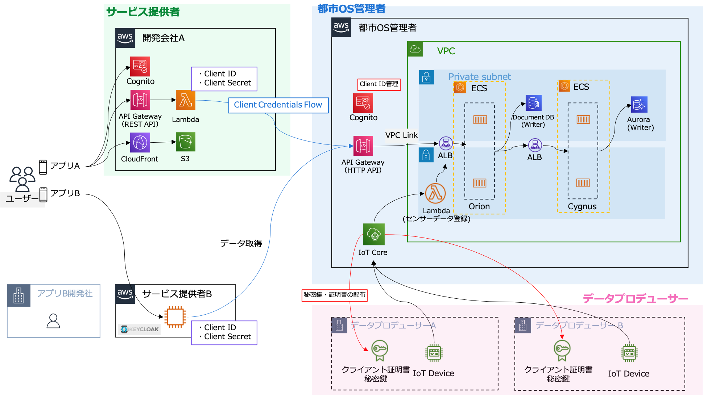

# Smart City Sample

このサンプルは [FIWARE Orion on AWS](https://github.com/aws-samples/fiware-orion-on-aws) のコードをベースに作成しています。

AWS 上で都市OSを構築する場合の構成になるかイメージしやすいよう、以下のステークホルダーを想定しています。

- 都市OS管理者: 都市OSを管理する主体。自治体が該当します
- サービス提供者: 都市OSのデータを利用してサービスを提供する事業者
- データプロデューサー: IoT 機器を管理する事業者

## アーキテクチャ

このサンプルでは、都市OS管理者·サービス提供者·データプロデューサーがそれぞれ色分けされた領域のリソースをデプロイすることを想定しています。



## ディレクトリ構成

```shell
.
├── README.md       # 本READMEファイル
├── city-os         # 都市OS管理者が利用
├── client          # サービス提供者が利用
└── data-producer   # データプロデューサーが利用
```

## デプロイ手順

都市OS（`city-os`）、データプロデューサー（`data-producer`）、サービス提供者（`client`）の順にデプロイをしていきます。
[都市OSのデプロイ](./city-os/README.md)へ進んでください。
