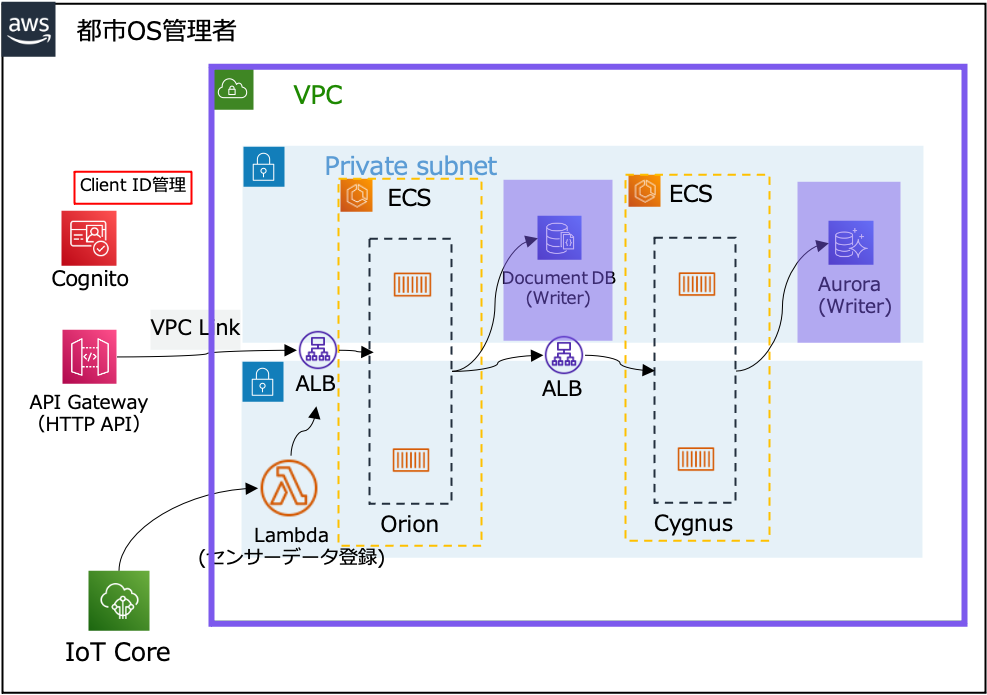
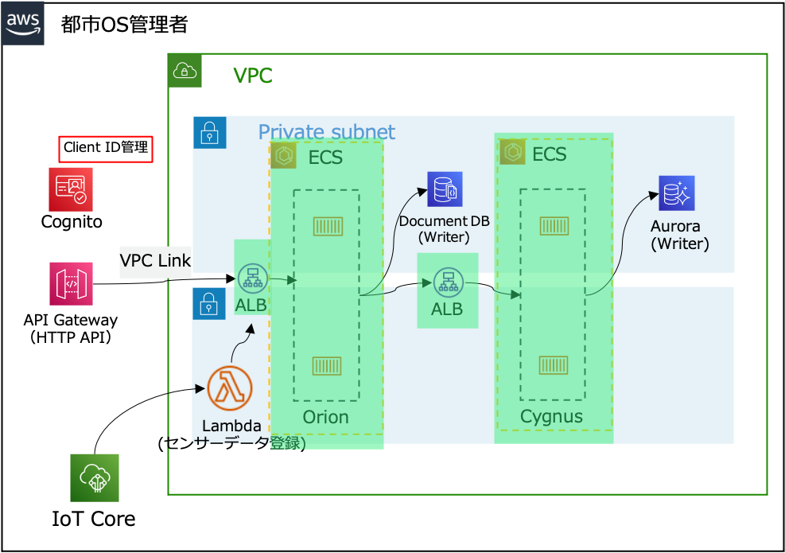
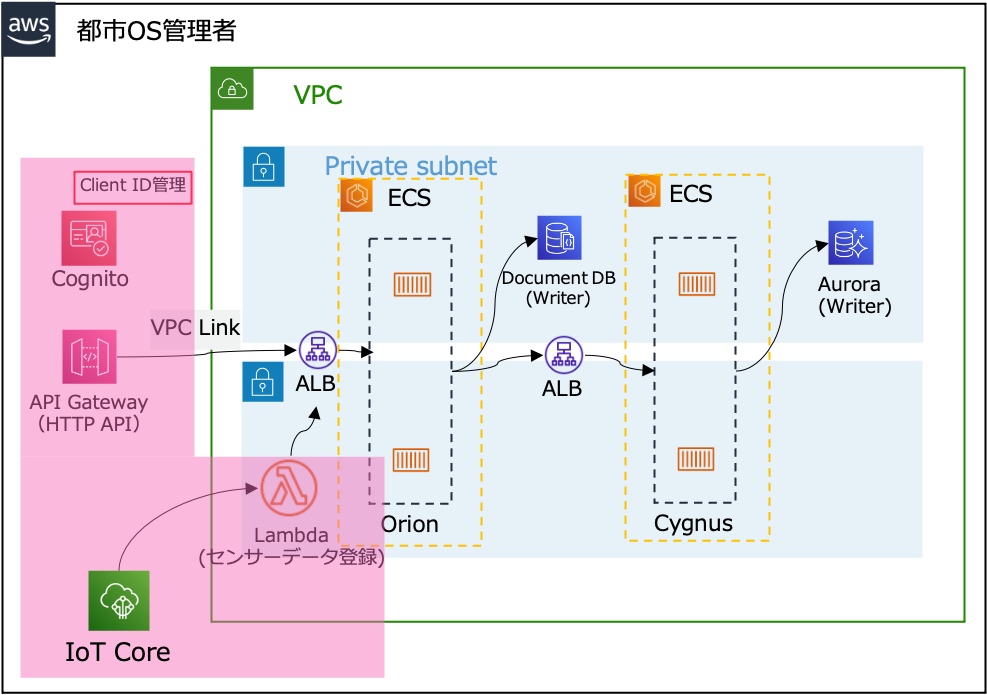

# FIWARE: Orion and Cygnus on AWS with Amazon API Gateway and Amazon Cognito

このディレクトリは、Fiware Orion と Cygnus コンポーネントをサーバーレスアーキテクチャにデプロイするために利用できます。

## このリポジトリの概要

1. AWS CDK で FIWARE Orion をデプロイするための基本的なリソース（VPCネットワーク、セキュリティグループ、2つのマネージドデータベース）のデプロイを行います。具体的には、以下のスタックを含みます。

    - Network Stack
      - Amazon VPC · Security Group
    - DocumentDB Stack
      - Amazon DocumentDB
    - Aurora Stack
      - Amazon Aurora

2. AWS ECS Fargate インスタンスと ALB をプロビジョニングするためのdocker-composeジェネレーターを利用します。これはCDKの後に実行されるnodeJSスクリプトで、各サービスごとに2つのdocker-composeを自動的に生成します。

3. その後、 FIWARE Orion の周辺リソースのデプロイを AWS CDK で行います。

    - IoT Stack
      - AWS IoT Core
    - APIGWCognitoStack
      - Amazon API Gateway · Amazon Cognito

## Architecture

- まず、このアーキテクチャーは AWS CDK で以下のリソースがデプロイされます。



- 次に、Docker Compose CLI で ECS · ALB などのリソースをデプロイします。



- 次に、API Gateway · IoT Core など、FIWARE Orion 周辺のリソースをデプロイします。



## デプロイ方法

### 1. Infrastructure

[AWS profile](https://docs.aws.amazon.com/cli/latest/userguide/cli-configure-profiles.html)を設定してください。

### 3. Deployer script

#### 3.1 前提条件

- node (v18.16.1<) のインストール
- AWS CDK (2.100.0<) のインストール

#### 3.2 Provisioning

基本的なインフラストラクチャーと docker-compose ジェネレーターは、以下の bash スクリプトで実行できます。

`$./deployer.sh <AWS_PROFILE>`

デプロイが完了すると、AWSアカウントでこれらのサービスが実行されているのを確認できます。

| AWS Service                     | Description                                 |
| ------------------------------- | ------------------------------------------- |
| AWS Fargate                     | Containers for Orion and Cygnus             |
| Application Load Balancer (ALB) | Load Balancer for Orion and Cygnus web api. |
| Amazon DocumentDB               | Database for Orion                          |
| Amazon Aurora Serverless        | Database for Cygnus                         |


### 4. Start Orion and Cygnus services

#### 4.1 前提条件

1. [docker](https://docs.docker.com/cloud/ecs-integration/)のインストール
2. FIWARE orion 環境用の docker コンテキストを作成または選択します。

```bash
$ docker context create ecs <context-name>
? Create a Docker context using: [Use arrows to move, type to filter]
  > An existing AWS profile  <- Note: Select this to use the AWS profile you created.

$ docker context use <context-name>
```

#### 4.2 Docker ECS integration を利用して FIWARE Orion and Cygnus をデプロイする

これらのDockerファイルは、[Docker ECS integration](https://docs.docker.com/cloud/ecs-integration/)を使用してビルドされています。詳細はリンクを確認してください。

以下のコマンドを実行してデプロイしてください。

1. Orion: `docker compose -p orion -f docker/orion/docker-compose.yml up`

2. Cygnus: `docker compose -p cygnus -f docker/cygnus/docker-compose.yml up`


### FIWARE Orion の周辺リソースのデプロイ

API Gateway · IoT Core など、FIWARE Orion 周辺のリソースをデプロイします。

0. `docker context use default`を実行します。

1. 以下のコマンドを実行してデプロイしてください。

    ```shell
    npx cdk deploy --require-approval never IoTStack APIGWCognitoStack
    ```

2. IoT Core のエンドポイントと HTTP API の URL が出力されるため、メモしておきます。[データプロデューサーのデプロイ](../data-producer/README.md)と[クライアントのデプロイ](../client/README.md)で利用します。

    ```shell
    Outputs:
    IoTStack.IoTEndpointUrl = xxxxxx-ats.iot.ap-northeast-1.amazonaws.com
    IoTStack.EntityInitCommand = aws lambda invoke --function-name xxxxxxxxx --payload '{"command":"init"}' --cli-binary-format raw-in-base64-out res.txt
    APIGWCognitoStack.OrionHttpAPIEndpointUrl = https://xxxxxxx.execute-api.ap-northeast-1.amazonaws.com
    ```

3. 上記のOutputsで出力されたEntityInitCommandを実行します。

    ```shell
    aws lambda invoke --function-name xxxxxxxxx --payload '{"command":"init"}' --cli-binary-format raw-in-base64-out res.txt
    ```

4. [Parameter Store の管理画面](https://ap-northeast-1.console.aws.amazon.com/systems-manager/parameters/?region=ap-northeast-1&tab=Table)へ移動し、IoT デバイスで利用する証明書: `/devices/sample-device-1/certPem` と 秘密鍵: `/devices/sample-device-1/privKey` の値をそれぞれメモしておいてください。[データプロデューサーのデプロイ](../data-producer/README.md)で利用します。\
※秘密鍵、証明書のコピーは`-----BEGIN XXXXX-----` から`-----END XXXXX-----` までコピーしてください。

5. [Amazon Cognito の管理画面](https://ap-northeast-1.console.aws.amazon.com/cognito/v2/idp/user-pools?region=ap-northeast-1)を開き、`UserPoolCityOS`と名前の入ったユーザープールを開き、Cognito ドメインをメモします。

6. 「アプリケーションの統合」タブから、`full-access-client`と名前の入ったアプリケーションクライアントを開きます。`クライアントID` と `クライアントシークレット` をメモします。

ここまでできたら[データプロデューサーのデプロイ](../data-producer/README.md)へ進んでください。
