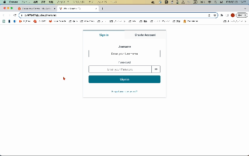
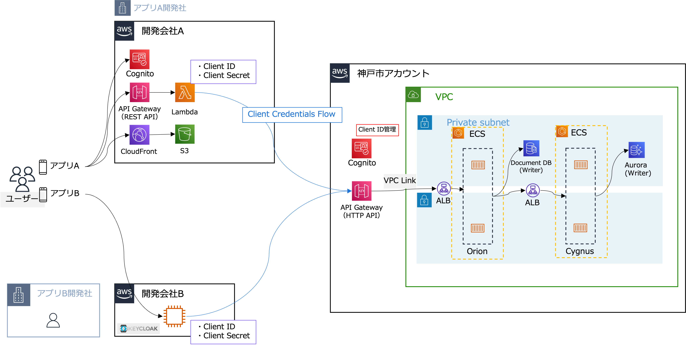
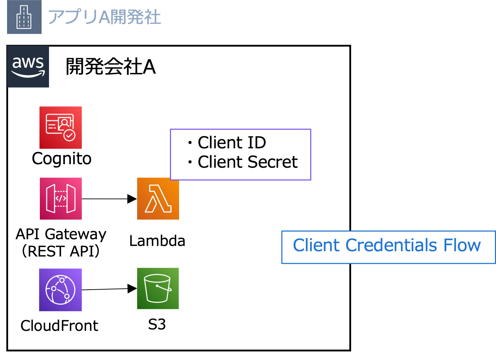

# Client App

## webアプリのデモの様子

このプロジェクトで作成するwebアプリの動作イメージです。

## 全体のアーキテクチャ

<!-- プロジェクトで作成するアーキテクチャの全体図です。
 -->

このプロジェクトでは以下のアーキテクチャ図のようにリソースをデプロイします。

## デプロイ手順

デプロイ手順はバックエンド、フロントエンドそれぞれのREADMEを参照してください。まずはバックエンドからデプロイし、次にフロントエンドをデプロイしてください。
* [バックエンド](backend/README.md)
* [フロントエンド](frontend/README.md)
