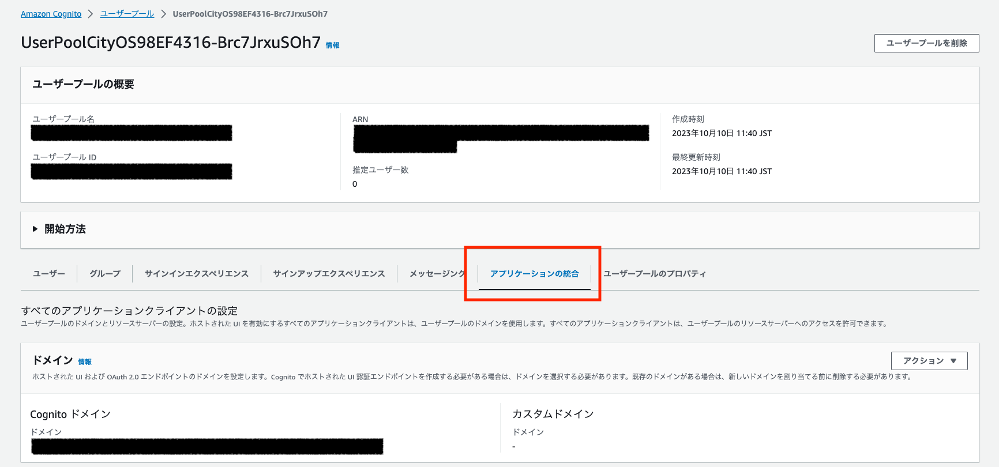
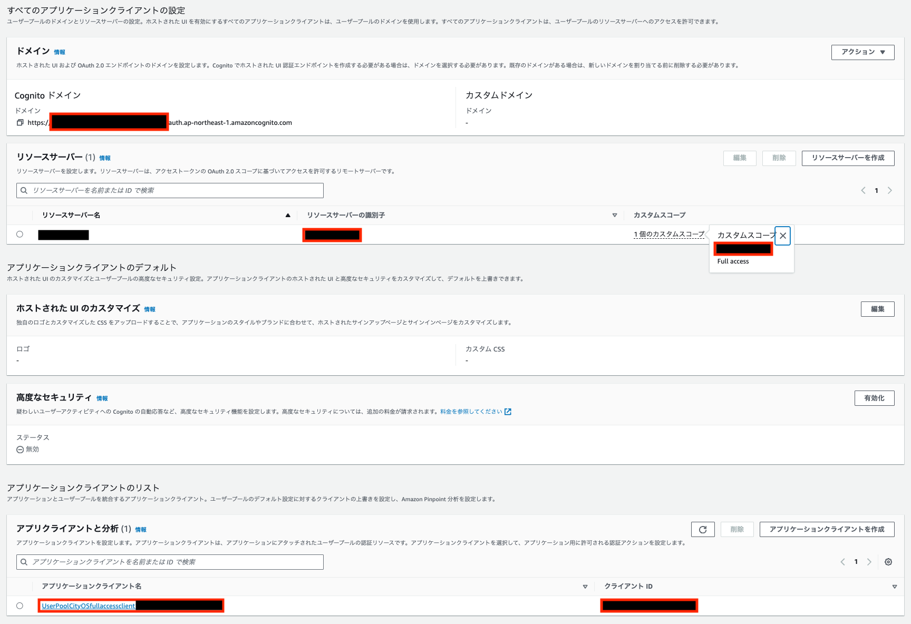
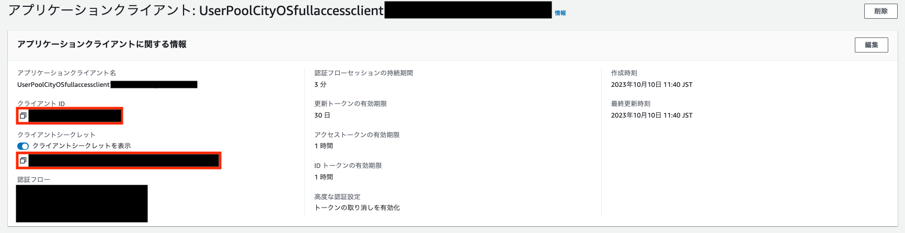

# Client Pythonプログラム

このプロジェクトでは、都市OSに対してリクエストを送信し、データを取得するPythonプログラムを提供します。

このプログラムでは、以下を実行します。
1. 都市OS側から受け取った認証情報を元に Client Credentials Flow を通して認証を行い、アクセストークンを取得します。
1. アクセストークンを含めてOrionに対してリクエストを実行し、データを取得します。

## ディレクトリ構成

```shell
.
├── README.md               # 本READMEファイル
├── images                  # READMEの画像配置ディレクトリ
├── get.py                  # データ取得プログラム
├── put_parameter.sh        # パラメータ登録スクリプト
```

## 実行手順
現在の作業ディレクトリが`smart-city-sample`直下であることを想定しています。

1. ディレクトリをclientへ移動します。
    ```sh
    cd ./client
    ```
1. Pythonプログラムを実行する前に、 Client Credentials Grant に必要なパラメータを Systems Manager Parameter Store に保存します。
このパラメータは、Pythonプログラム内で取得されます。

    この手順では、[`put-parameter.sh`](./put-parameter.sh) を開き、必要な値を入力していきます。
    ```sh
    CLIENT_ID=XXXXXXXXXXXXXXXXXXXXXXXXXX # クライアントID
    CLIENT_SECRET=XXXXXXXXXXXXXXXXXXXXXXXXXXXXXXXXXXXXXXXXXXXXXXXXXXXX # クライアントシークレット
    RESOUCE_SERVER_ID=XXXXX # リソースサーバーの識別子
    CUSTOM_SCOPE=XXXX # カスタムスコープ
    SCOPE=$RESOUCE_SERVER_ID/$CUSTOM_SCOPE
    COGNITO_ENDPOINT=https://XXXXXXXXXXXX.auth.ap-northeast-1.amazoncognito.com/oauth2/token # Cognito認証ドメイン
    API_ENDPOINT=https://XXXXXXXX.XXXXXXX.XXXXXXXXXX.XXXXXXXXX.XXX/ # HTTP API のエンドポイント
    .
    .
    .
    ```

    まず、[Cognitoマネジメントコンソール](https://console.aws.amazon.com/cognito/home)を開き、名前に`UserPoolCityOS`とある Cognito ユーザプールを選択し、アプリケーションの統合をクリックしてください。これは先ほど [City OS のデプロイ](../city-os/README.md)でデプロイした Cognito ユーザプールです。

    

    次に、以下の手順で [`put-parameter.sh`](./put-parameter.sh) に必要な値を入力してください。

    1. `RESOUCE_SERVER_ID`と`CUSTOM_SCOPE`は以下の赤枠の値をそのまま入力、`COGNITO_ENDPOINT` は、Cognitoドメインの一意の識別子の部分をXXXXX部に入力してください。
        
    
    1. アプリケーションクライアントのリストから、名前に`UserPoolCityOSfullaccessclient`がついたアプリケーションクライアントのリンクをクリックします。

    1. `CLIENT_ID`と`CLIENT_SECRET`は、各項目の横のアイコンをクリックしてコピーし、それぞれ入力を行ってください。

        
    
    1. `API_ENDPOINT` は、 FIWARE orion の周辺リソースをデプロイした際に出力された、 `APIGWCognitoStack.OrionHttpAPIEndpointUrl` の値を入力してください（最後の"/"まで含めてください）。

    その後、[`put-parameter.sh`](./put-parameter.sh) を実行し、パラメータを保存してください。
    ```sh
    sh put-parameter.sh
    ```

1. Pythonプログラムの実行に必要なパッケージをインストールします。
    ```sh
    pip3 install requests==2.31.0
    ```

1. Pythonプログラムを実行します。
    ```sh
    python3 get.py urn:ngsi-ld:Store:001
    ```

1. 店舗の名前、温度、湿度のデータが取得できていれば成功です。間隔を空けて実行すると、更新されたデータを取得していることが分かります。
    ```sh
    $ python3 get.py urn:ngsi-ld:Store:001
     store name: Bösebrücke Einkauf
       humidity: 40
    temperature: 17
    $ python3 get.py urn:ngsi-ld:Store:001
     store name: Bösebrücke Einkauf
       humidity: 54
    temperature: 24
    ```