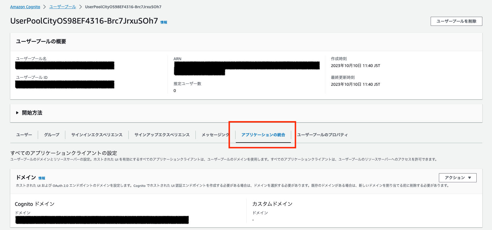
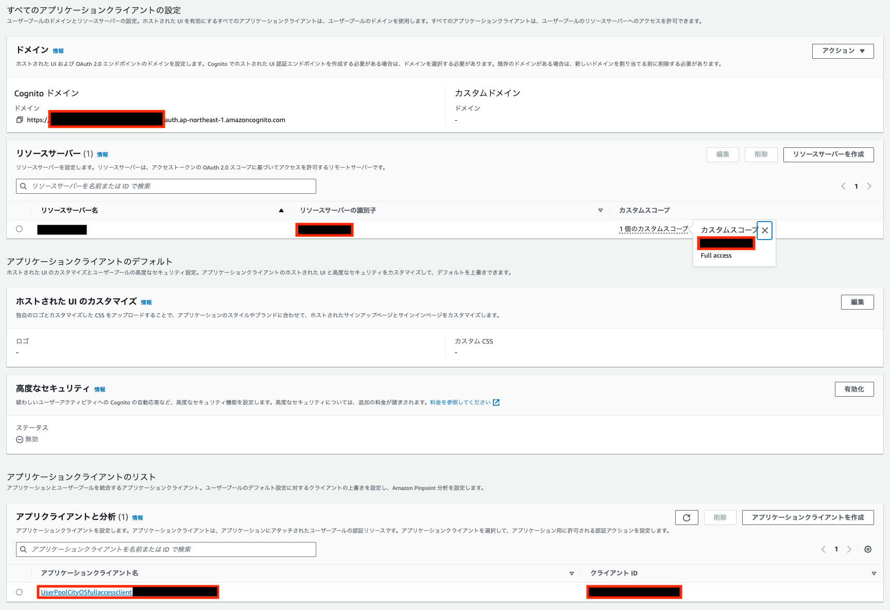
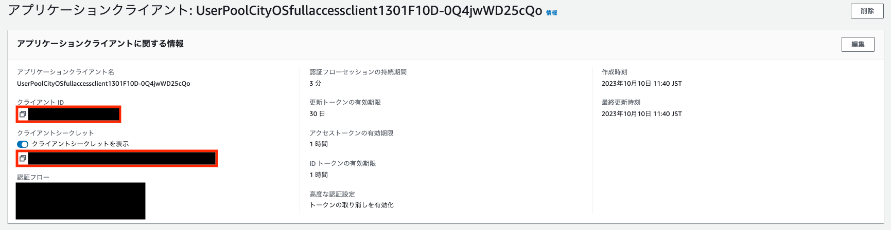

# Client バックエンド

## デプロイ手順

### デプロイ実行環境の準備

デプロイを実行する端末には、下記のソフトウェアが必要です。

* AWS CLI
* Node.js 14以上

次に、必要な依存関係をインストールします。以下のコマンドを実行してください。

なお、以下全て、シェルコマンドの初期カレントディレクトリはこの `README.md` が配置されたディレクトリと仮定します。

```sh
# IaCの依存関係をインストール
npm ci

# CDKを ap-northeast-1 リージョンで使えるように初期化する
AWS_REGION=ap-northeast-1 npx cdk bootstrap
```

### バックエンドリソースのデプロイ

1. バックエンドのリソースをデプロイする前に、 Client Credentials Grant に必要なパラメータを Systems Manager Parameter Store に保存します。
このパラメータは、 API を呼び出した際に実行されるLambda関数から取得されます。

    [`put-parameter.sh`](./put-parameter.sh) を開き、必要な値を入力してください。
    ```sh
    CLIENT_ID=XXXXXXXXXXXXXXXXXXXXXXXXXX # クライアントID
    CLIENT_SECRET=XXXXXXXXXXXXXXXXXXXXXXXXXXXXXXXXXXXXXXXXXXXXXXXXXXXX # クライアントシークレット
    RESOUCE_SERVER_ID=XXXXX # リソースサーバーの識別子
    CUSTOM_SCOPE=XXXX # カスタムスコープ
    SCOPE=$RESOUCE_SERVER_ID/$CUSTOM_SCOPE
    COGNITO_ENDPOINT=https://XXXXXXXXXXXX.auth.ap-northeast-1.amazoncognito.com/oauth2/token # Cognito認証ドメイン
    API_ENDPOINT=https://XXXXXXXX.execute-api.ap-northeast-1.amazonaws.com/ # HTTP API のエンドポイント
    .
    .
    .
    ```

    [Cognitoマネジメントコンソール](https://console.aws.amazon.com/cognito/home)を開き、名前に UserPoolCityOS とあるCognitoユーザプールを選択し、アプリケーションの統合をクリックしてください。これは先ほど [City OS のデプロイ](../../city-os/README.md)でデプロイした Cognito ユーザプールです。

    

    次に、以下に注意して [`put-parameter.sh`](./put-parameter.sh) に必要な値を入力してください。

    - `RESOUCE_SERVER_ID`と`CUSTOM_SCOPE`は以下の赤枠の値をそのまま入力、`COGNITO_ENDPOINT` は、Cognitoドメインのうち一意の識別子の部分をXXXXX部に入力してください。
        

    - `CLIENT_ID`と`CLIENT_SECRET`は、アプリケーションクライアント名のリンクをクリックして閲覧することができます。

        
    
    - `API_ENDPOINT` は、 FIWARE orion の周辺リソースをデプロイした際に出力された、 `APIGWCognitoStack.OrionHttpAPIEndpointUrl` の値を入力してください。

    その後、[`put-parameter.sh`](./put-parameter.sh) を実行してください。

    ```sh
    sh put-parameter.sh
    ```

1. バックエンドのリソースを新規にデプロイするためには、下記コマンドを実行します。

    ```sh
    npx cdk deploy BackendStack --require-approval never
    ```

    デプロイ完了後に表示されるStack Outputをメモしておいてください。

    ```shell
    Outputs:
    BackendStack.CognitoUserPoolId = ap-northeast-1_XXXXXXXXX
    BackendStack.CognitoUserPoolWebClientId = XXXXXXXXXXXXXXXXX
    BackendStack.apiGatewayEndpoint8F3C8843 = https://XXXXXXX.execute-api.ap-northeast-1.amazonaws.com/
    ```

1. Cognitoユーザの作成

    - ユーザー名: `demo-user`、パスワード: `cam4PTF.wdg1znw8vnk`のユーザーを作成します。
    - ユーザーの作成をするために、以下のコマンドを実行します。`<user-pool-id>`の箇所は手順2のアウトプットのCognitoのユーザープールIDに置き換えてください。**[City OSのデプロイ](../../city-os/README.md)でデプロイした Cognito ユーザプールではないため注意してください。**

        ```shell
        aws cognito-idp admin-create-user \
        --user-pool-id "<user-pool-id>" \
        --username "demo-user" \
        --user-attributes Name=email,Value="demo@example.com" Name=email_verified,Value=true \
        --message-action SUPPRESS
        ```

    - ユーザーのパスワードを設定します。

        ```shell
        aws cognito-idp admin-set-user-password \
        --user-pool-id "<user-pool-id>" \
        --username "demo-user" \
        --password 'cam4PTF.wdg1znw8vnk' \
        --permanent
        ```

これでバックエンドのデプロイは完了です。
ここまでできたら[フロントエンドのデプロイ](../frontend/README.md)へ進んでください。
