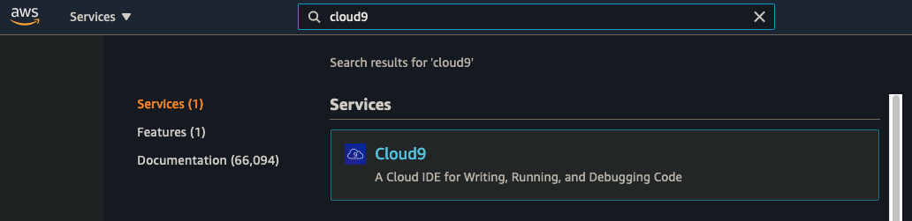
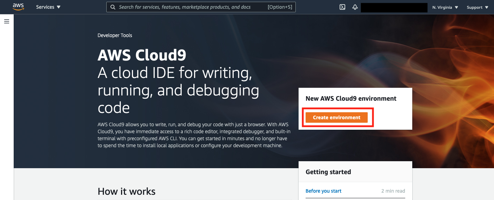
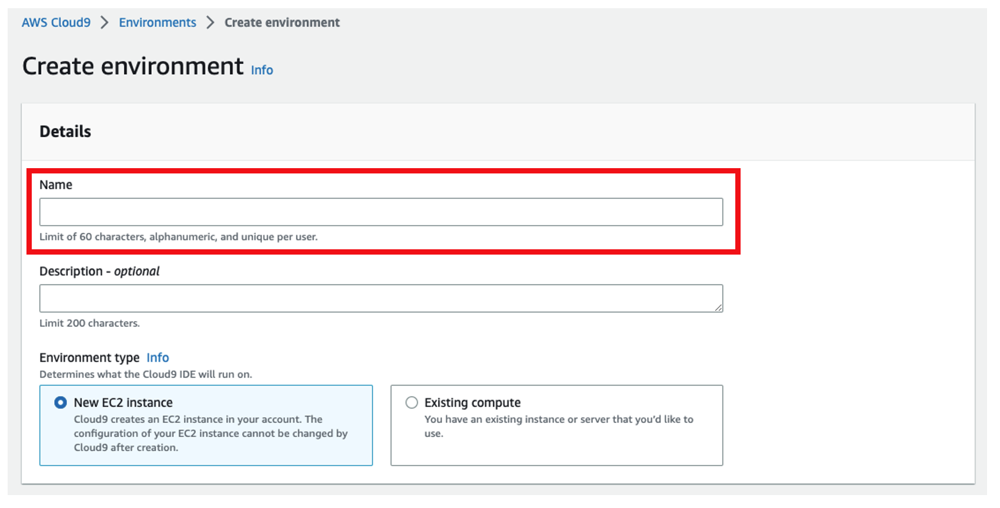
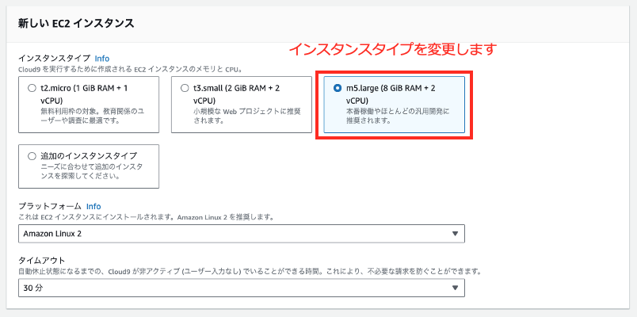
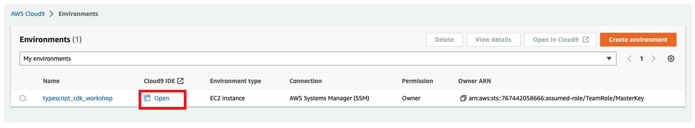

# Cloud9 での環境のセットアップ

[AWS Cloud9](https://aws.amazon.com/jp/cloud9/) 上で本リポジトリをデプロイするための設定をしていきます。

## Cloud9 インスタンスの作成

ここでは、Smart City のサンプルをデプロイする実行環境を準備するために AWS Cloud9 をセットアップします。

1. [マネジメントコンソール](https://console.aws.amazon.com/console/home) の検索バーに `Cloud9` と入力します。
AWS Cloud9 をクリックします。

    

2. 以下の画面の [Create Environment] をクリックします。

    

3. 次に、以下の [Name] に `typescript_cdk_workshop` と入力します。

    

4. `Configure Settings` の画面では、以下のように `New EC2 instance` の項目で `t3.small (2 GiB RAM + 2 vCPU)` を選択し、そのほかの設定は変更せずに画面下部にある `Create` をクリックします。

    

5. Cloud9 環境が作成され、以下の画面に遷移したら、`Open` をクリックしてください。Cloud9 の画面が開きます。

    

## Cloud9 インスタンス内の環境セットアップ

以下のコマンドは`~/environment`直下で実行されることを想定しています。

1. ソースコードを GitHub から Clone します。

    ```shell
    git clone https://github.com/hako884/smartcity-workshop
    ```

2. Docker Compose CLI をインストールします。

    ```shell
    cd smartcity-workshop/cloud9-setup/
    sh ./init.sh
    ```

3. Cloud9 のボリュームを 50 GiB に増やします。

    ```shell
    sh ./resize.sh
    ```

ここまでできたら[city-osのデプロイ](../city-os/README.md)へ進んでください。
