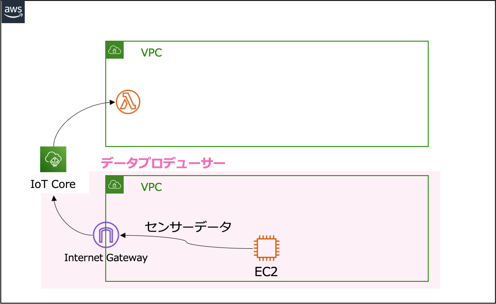
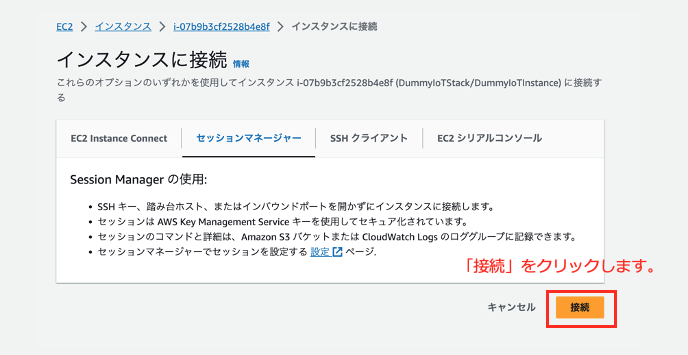
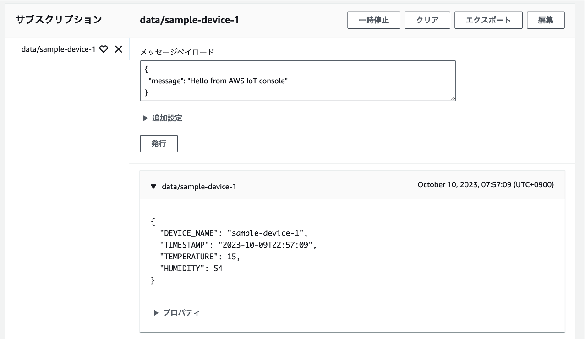

# データプロデューサー

ここでは、 IoT デバイスに見立てた Amazon EC2 インスタンスからデータをリアルタイムにクラウドへ送信する機能を構築します。

## アーキテクチャ

以下のアーキテクチャのピンクで囲まれた箇所のリソースがこのディレクトリの CDK でデプロイできます。



## ディレクトリ構成

```shell
.
├── README.md               # 本READMEファイル
├── bin                     # CDK App の定義ディレクトリ
├── cdk.json                # CDK の設定ファイル
├── images                  # READMEの画像配置ディレクトリ
├── jest.config.js          # Jest（テストツール）設定ファイル（未使用）
├── lib                     # Stack 定義ディレクトリ
├── package-lock.json       # 実際にインストールされたパッケージ定義ファイル
├── package.json            # パッケージ定義ファイル
├── test                    # CDKのテスト（未使用）
└── tsconfig.json           # TypeScript の設定ファイル
```

## デプロイ手順

以下のコマンドでディレクトリを`smart-city-sample/data-producer`へ移動します。
現在の作業ディレクトリが`smart-city-sample`直下であることを想定しています。

### リソースのデプロイ

```shell
cd ./data-producer
```

パッケージをインストールします。

```shell
npm ci
```

`DummyIoTStack`をデプロイします。

```shell
npx cdk deploy
```

コマンドが成功すると以下のような出力が表示されるため、リンクをブラウザに貼り付けて Session Manager のページを開きます。

```shell
Outputs:
DummyIoTStack.DummyIoTInstanceConsole = https://ap-northeast-1.console.aws.amazon.com/ec2/home?region=ap-northeast-1#ConnectToInstance:instanceId=i-xxxxxxxxxx
```

### IoT デバイスの設定
以下の「接続」のボタンをクリックし、インスタンスへ接続します。



`ec2-user` へ切り替えます。

```shell
sudo su - ec2-user
```

[city-os](../city-os/README.md) でデプロイした秘密鍵を書き込みます。`<>`で囲んだ箇所を秘密鍵の内容に置き換えてください。

```shell
cat << EOF > /home/ec2-user/environment/dummy_client/certs/sample-private.pem.key
<city-os でデプロイした秘密鍵の内容記入>
EOF
```

[city-os](../city-os/README.md) でデプロイした証明書の内容を書き込みます。`<>`で囲んだ箇所を証明書の内容に置き換えてください。

```shell
cat << EOF > /home/ec2-user/environment/dummy_client/certs/sample-certificate.pem.crt
<city-os でデプロイした証明書の内容記入>
EOF
```

ダミーデータを送信するプログラムを動作させます。

```shell
cd /home/ec2-user/environment/dummy_client/
python3 device_main.py --device_name sample-device-1 --endpoint xxxxxxx-ats.iot.ap-northeast-1.amazonaws.com
```

以下のような出力が表示されたら正常に動作しています。

```shell
evice_name: sample-device-1
endpoint: xxxxxxxxx-ats.iot.ap-northeast-1.amazonaws.com
rootca cert: ./certs/AmazonRootCA1.pem
private key: ./certs/sample-private.pem.key
certificate: ./certs/sample-certificate.pem.crt
Check latest Shadow status
Subscribing to Shadow Delta events...
Finished getting initial shadow state.
  Shadow contains reported wait_time: '5'
un subscribe from get shadow events
Subscribing to Shadow Update responses...
topic: data/sample-device-1
```

## 動作確認

[AWS IoT Core の MQTT テスト画面](https://ap-northeast-1.console.aws.amazon.com/iot/home?region=ap-northeast-1#/test)へ移動します。

「トピックのフィルター」に`data/sample-device-1`と入力し、「サブスクライブ」を押します。

以下の画像のように、IoT センサーのデータが表示されたら成功です。


